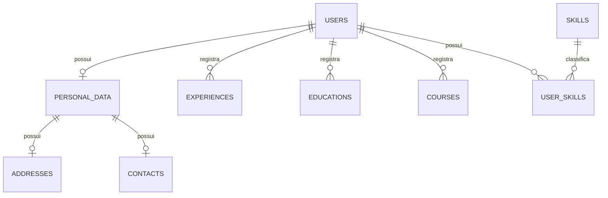

# Currículo Online API

API REST para cadastro e gerenciamento de currículos profissionais. O projeto permite armazenar dados pessoais, endereço, contatos, experiências profissionais, escolaridade, cursos, qualificações e habilidades.

## Tecnologias

- [Node.js](https://nodejs.org/)
- [NestJS](https://nestjs.com/)
- [TypeORM](https://typeorm.io/)
- [PostgreSQL](https://www.postgresql.org/)
- REST API
- TypeScript

## Funcionalidades

### Usuários

- Cadastro com e-mail e senha;
- E-mail único;
- Senha armazenada apenas como hash;
- Controle de usuário ativo ou inativo;
- Registro das datas de criação e atualização.

### Dados pessoais

- CPF;
- Nome completo;
- Data de nascimento;
- Sexo;
- Nacionalidade;
- Estado civil;
- Naturalidade;
- Endereço completo:
  - CEP;
  - Logradouro;
  - Número;
  - Complemento;
  - Bairro;
  - Cidade;
  - Estado;
- Contatos:
  - Celular;
  - Telefone fixo;
  - Telefone para recado.

### Experiências profissionais

- Nome da empresa;
- Cargo;
- Setor;
- Data de entrada;
- Data de saída;
- Indicação de emprego atual;
- Descrição das atividades do cargo.

### Escolaridade

- Instituição;
- Curso ou formação;
- Situação de conclusão;
- Ano de conclusão;
- Nível:
  - Analfabeto;
  - Ensino Fundamental;
  - Ensino Médio;
  - Graduação;
  - Especialização;
  - Mestrado;
  - Doutorado;
- Descrição do curso ou formação.

### Cursos e qualificações

- Instituição;
- Nome do curso;
- Tipo do curso, como técnico, profissionalizante, extensão ou certificação;
- Modalidade presencial ou on-line;
- Carga horária;
- Ano de conclusão;
- Descrição.

### Habilidades

- Soft skills, como comunicação, criatividade e bom humor;
- Hard skills, como programação e análise de dados;
- Associação de várias habilidades ao currículo.

## Modelo de dados



O script completo para importação no dbdiagram.io está no arquivo [`database.dbml`](./database.dbml).

## Organização sugerida

```text
src/
├── app.module.ts
├── common/
│   ├── decorators/
│   ├── filters/
│   ├── guards/
│   └── interceptors/
├── config/
│   └── database.config.ts
├── database/
│   └── migrations/
└── modules/
    ├── auth/
    ├── users/
    ├── personal-data/
    ├── experiences/
    ├── educations/
    ├── courses/
    └── skills/
```

Cada módulo pode conter `controller`, `service`, `entity`, `dto` e seu respectivo arquivo de módulo.

## Pré-requisitos

- Node.js 20 ou superior;
- npm 10 ou superior;
- PostgreSQL 15 ou superior.

## Configuração

1. Clone o repositório:

```bash
git clone <URL_DO_REPOSITORIO>
cd curriculo-online-api
```

2. Instale as dependências:

```bash
npm install
```

3. Crie um arquivo `.env` com base no exemplo:

```env
NODE_ENV=development
PORT=3000

DB_HOST=localhost
DB_PORT=5432
DB_USERNAME=postgres
DB_PASSWORD=postgres
DB_DATABASE=curriculo_online
DB_SSL=false

JWT_SECRET=substitua-por-uma-chave-segura
JWT_EXPIRES_IN=1d
BCRYPT_SALT_ROUNDS=12
```

4. Crie o banco de dados:

```sql
CREATE DATABASE curriculo_online;
```

5. Execute as migrations:

```bash
npm run migration:run
```

6. Inicie a aplicação:

```bash
npm run start:dev
```

A API estará disponível, por padrão, em `http://localhost:3000/api`.

## Scripts sugeridos

```bash
# Desenvolvimento
npm run start:dev

# Build
npm run build

# Produção
npm run start:prod

# Testes
npm run test
npm run test:e2e
npm run test:cov

# Qualidade
npm run lint
npm run format

# TypeORM
npm run migration:generate -- src/database/migrations/NomeDaMigration
npm run migration:run
npm run migration:revert
```

Os comandos de migration precisam ser adicionados ao `package.json` conforme a configuração do DataSource do projeto.

## Endpoints planejados

### Autenticação e usuário

| Método | Endpoint | Descrição |
| --- | --- | --- |
| `POST` | `/api/auth/register` | Cadastra um usuário |
| `POST` | `/api/auth/login` | Autentica o usuário |
| `GET` | `/api/users/me` | Consulta o usuário autenticado |
| `PATCH` | `/api/users/me` | Atualiza e-mail ou senha |
| `PATCH` | `/api/users/me/status` | Ativa ou inativa o usuário |

### Currículo

| Método | Endpoint | Descrição |
| --- | --- | --- |
| `GET` | `/api/profile` | Retorna o currículo completo |
| `PUT` | `/api/profile/personal-data` | Cria ou atualiza dados pessoais |
| `PUT` | `/api/profile/address` | Cria ou atualiza o endereço |
| `PUT` | `/api/profile/contact` | Cria ou atualiza os contatos |

### Coleções do currículo

| Recurso | Endpoint base |
| --- | --- |
| Experiências | `/api/experiences` |
| Escolaridades | `/api/educations` |
| Cursos | `/api/courses` |
| Habilidades | `/api/skills` |

Os recursos de coleção devem oferecer `POST`, `GET`, `GET /:id`, `PATCH /:id` e `DELETE /:id`, respeitando a propriedade do usuário autenticado.

## Regras de negócio

- Um e-mail pertence a apenas um usuário;
- Um CPF pertence a apenas um perfil;
- Cada usuário pode possuir somente um cadastro de dados pessoais;
- A data de saída da experiência deve ser igual ou posterior à data de entrada;
- Quando `is_current` for `true`, `end_date` deve ser nulo;
- O ano de conclusão só deve ser obrigatório quando a formação ou curso estiver concluído;
- Uma habilidade não deve ser duplicada para o mesmo usuário;
- Usuários só podem consultar e alterar os próprios dados;
- Registros relacionados ao usuário devem ser removidos ou anonimizados conforme a política definida para exclusão da conta.

## Validação e segurança

- Validar os DTOs com `class-validator` e `ValidationPipe`;
- Normalizar e validar e-mail;
- Validar CPF antes de persistir;
- Armazenar senha com hash usando `bcrypt` ou `argon2`;
- Nunca retornar `password_hash` nas respostas;
- Proteger rotas privadas com JWT e guards;
- Aplicar rate limit nos endpoints de autenticação;
- Usar migrations em vez de `synchronize: true` fora de testes locais;
- Manter credenciais somente em variáveis de ambiente;
- Configurar CORS de acordo com o frontend autorizado;
- Evitar registrar CPF, senha, token ou outros dados pessoais sensíveis nos logs.

## Padrão de respostas de erro

```json
{
  "statusCode": 400,
  "error": "Bad Request",
  "message": [
    "email must be an email"
  ],
  "path": "/api/auth/register",
  "timestamp": "2026-07-23T15:00:00.000Z"
}
```

## Documentação da API

É recomendado usar Swagger com `@nestjs/swagger`. Após a configuração, a documentação pode ser publicada em:

```text
http://localhost:3000/api/docs
```

## Roadmap inicial

- [ ] Configurar NestJS, TypeORM e PostgreSQL;
- [ ] Criar migrations e entidades;
- [ ] Implementar cadastro e autenticação;
- [ ] Implementar dados pessoais, endereço e contatos;
- [ ] Implementar experiências profissionais;
- [ ] Implementar escolaridade;
- [ ] Implementar cursos e qualificações;
- [ ] Implementar habilidades;
- [ ] Adicionar Swagger;
- [ ] Criar testes unitários e end-to-end;
- [ ] Adicionar Docker e pipeline de integração contínua.

## Licença

Defina a licença do projeto antes da publicação. Para projetos privados, remova esta seção ou informe que todos os direitos são reservados.